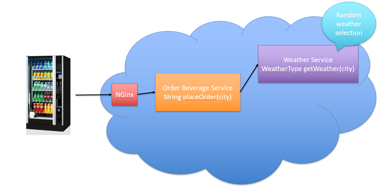

# Pre-requirements

- Docker
- Docker-compose
- Python 3.5+ (with asyncio and aiohttp)
- libssl-dev (apt-get install libssl-dev)
- libz-dev (apt-get install libz-dev)
- luarocks (apt-get install luarocks)
- luasocket (luarocks install luasocket
- Thrift 0.14.0 (./configure --with-lua --with-cpp --with-py)
-- (Thrift tutorial: https://www.youtube.com/watch?v=NK6hz2JM89w)

## Application Structure

# Cheatsheet on thrift 

To compile vending_machine.thrift:

thrift --gen cpp vending_machine.thrift

thrift --gen py vending_machine.thrift

thrift --gen lua vending_machine.thrift

# cheatsheet on docker commands

# 1. To create docker image from docker file:
 sudo docker build -t labnic/challenge2ece578 .
# 2. List docker images:
 sudo docker images -a
# 3. Retag the image with a version number: 
 sudo  docker tag labnic/challenge2ece578 labnicuofm/challenge2ece578:version_1
# 4. Docker-Hub login:
 sudo docker login
# 5. Push the local image to docker-hub
 sudo docker push labnicuofm/challenge2ece578:version_1 
# 6. List docker containers:
 sudo docker ps -a

#Build 
sudo docker build -t labnicuofm/challenge2ece578 .
sudo docker push labnicuofm/challenge2ece578:version_1

Ref: 
1. https://stackify.com/docker-build-a-beginners-guide-to-building-docker-images/
2. https://www.digitalocean.com/community/tutorials/how-to-remove-docker-images-containers-and-volumes

# cheatsheet on docker-compose

1. Run docker-compose script to run all the containers:
sudo docker-compose up
2. Stop docker containers that started from docker-compose script:
sudo docker-compose down

#openresty
wget https://openresty.org/download/openresty-1.19.3.1rc1.tar.gz

apt-get install libpcre3-dev \
    libssl-dev perl make build-essential curl

tar -xvf openresty-VERSION.tar.gz
cd openresty-VERSION/
./configure
sudo make 
sudo make install

export PATH=/usr/local/openresty/bin:$PATH

#docker communicaiton
curl -d "city_id=1" 127.0.0.1:8080

